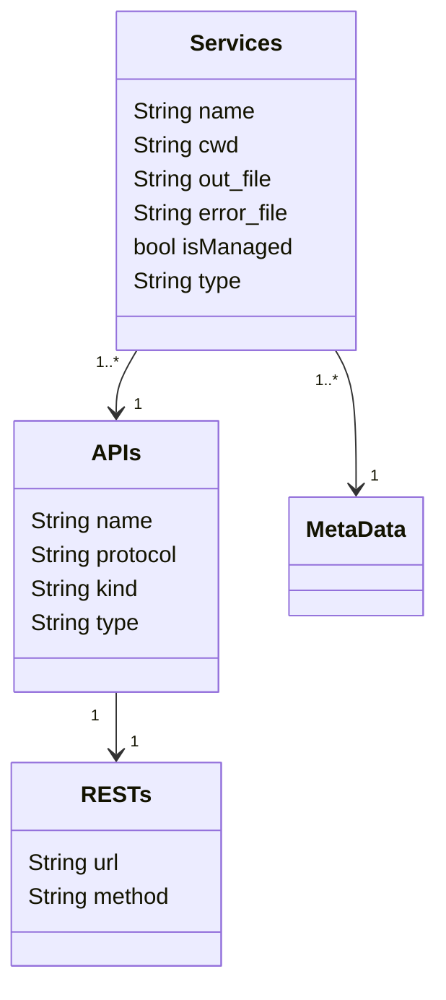

```mermaid
classDiagram
class Services{
    String name
    String cwd
    String out_file
    String error_file
    bool isManaged
    String type
}
class APIs{
    String name
    String protocol
    String kind
    String type
}
class RESTs{
    String url
    String method
}
Services "1..*" --> "1" APIs
APIs "1" --> "1" RESTs
Services "1..*" --> "1" MetaData
```
